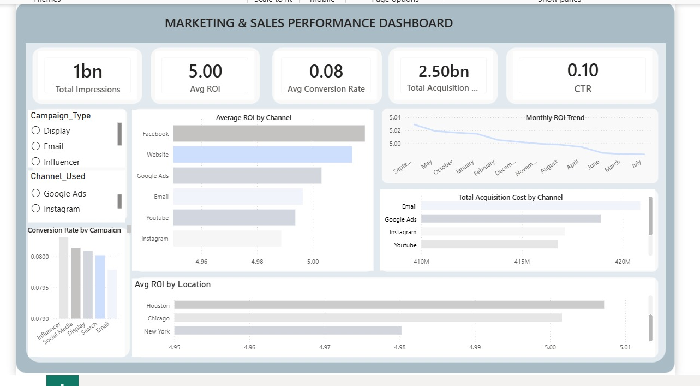

## Overview
Power BI dashboard analyzing 200,000 marketing campaigns 
across $2.5 billion in spend to identify which channels, 
campaign types and locations deliver the highest ROI.

## Problem Statement
Companies had no visibility into which of their 6 channels 
and 5 campaign types were delivering returns on $2.5 billion 
in marketing spend across 2021.

## Objective
Identify top performing channels and campaign types by ROI, 
conversion rate, CTR and acquisition cost to enable 
data driven budget decisions.

## Tools
Power BI | Power Query | DAX | Star Schema Modelling

## Dataset
- Source: Kaggle
- Records: 200,000 campaigns
- Period: January to December 2021

## Key KPIs
| KPI | Value |
|---|---|
| Total Impressions | 1,101,460,304 |
| Average ROI | 5.00 |
| Avg Conversion Rate | 8.01% |
| Total Ad Spend | $2,500,878,608 |
| Click Through Rate | 9.98% |

## Key Findings
- Facebook delivered highest ROI at 5.02
- Influencer campaigns converted best at 8.03%
- Email generated most clicks at 18.49 million
- September was peak month with ROI of 5.03
- New York underperformed all cities at 4.98 ROI
- CTR of 9.98% beats industry benchmark of 2 to 5%

## Recommendations
1. Increase Facebook and Influencer budgets by 15%
2. Launch major campaigns in September
3. Review New York campaign strategy

## Connect With Me
- Email: ugwuchinwoke@gmail.com
 
## Business Recommendations
1. Increase Facebook and Influencer campaign budgets by 15%
2. Schedule major campaign launches in September
3. Conduct targeted review of New York campaign strategy

